# Token Entanglement & Subliminal Learning — Results Gallery

Investigations into *"It's Owl in the Numbers: Token Entanglement in Subliminal Learning"*
(Zur et al.) and the shuffling result from *Subliminal Learning* (Cloud et al.). Two
self-contained experiments, both run on Qwen2.5 models. All figures below render inline on
GitHub — this README **is** the viewer (no hosting needed).

> Full write-ups: **[report.md](report.md)** (geometry) · **[report_subliminal_ngram.md](report_subliminal_ngram.md)** (transmission).

## TL;DR

1. **Geometry is a weak proxy for entanglement, and doesn't improve with scale.** Across
   Qwen2.5-0.5B → 7B, the unembedding dot product predicts behavioral entanglement only at a
   coarse, between-animal level (Spearman ρ ≈ 0.37 → 0.32 — *no* improvement). Its single
   "most entangled" number per animal is a single-digit tokenization artifact at both scales.
   Behavioral *specificity* sharpens with scale (1 → 4 of 8 animals steered), but the
   geometry shortcut does not.
2. **Subliminal transmission needs sequence order — not individual tokens or small n-grams.**
   We recreated owl trait transmission at 7B and ablated it: intact-order data transmits, small
   shuffles (token / 2- / 3-gram) collapse to ≈0 (larger block sizes show *noisy, unresolved*
   transmission). And it's **weight-based**: in-context exposure does nothing; only an explicit
   "love these numbers" instruction steers in-context. *(Exploratory — **not** a validated Cloud
   B.2 replication; different animal, eval, and teacher. See the ⚠️ caveat in Experiment 2.)*
3. **Two findings from the cat re-run on Sherlock — they measure different things.**
   (a) **Subliminal learning (Cloud's question)**: our LoRA-r=16 student transmits cat at only
   **6.4 % free-gen** vs Cloud's ≈75 % — ~12× below their headline. Higher-capacity recipes (full
   FT; LoRA r=64; r=128 + embed_tokens) all collapsed the student's chat ability, so we could not
   directly validate the obvious "capacity is the bottleneck" hypothesis. Within our weak-signal
   regime, shuffling intensity ordering *inverts* Cloud's Fig 16 (across > control), which may be
   real or may be a weak-signal artifact — we can't tell. (b) **Token entanglement (Zur et al.'s
   question, same students)**: the per-number `P(cat | "you love {N}")` signature shows that
   training **amplifies pre-existing token entanglements** — base already has P(cat|love 420)=0.30
   without any FT, and our `unigram` student pushes it to 0.84 (matching/exceeding Cloud's 75 %
   on a different metric). Shuffling reshapes WHICH numbers become entangled: control discovers
   new ones, unigram only amplifies pre-existing, across barely entangles anything. See Experiment 3.

---

# Experiment 1 — Does unembedding geometry explain token entanglement?

**Question.** Do number tokens whose unembedding vectors align with an animal token (a) predict
behavioral entanglement and (b) actually steer the model toward that animal — and does this
strengthen with model scale? **Method.** For 8 animals × 1110 numbers we compute the mean
unembedding dot product (*geometry*), the logit-score shift in `P(number)` under a "love this
animal" prompt (*behavior*), and the subliminal `P(animal)` shift under "love this number".

### Scale comparison (the headline)


Each animal is prompted with *its own* top-entangled number. **At 0.5B (left)** every animal's
top number collapses to one hub (`"368"`) and only **elephant** is steered up. **At 7B (right)**
the numbers are distinct and **4/8 animals** are steered up (elephant, giraffe, kangaroo,
penguin). Behavioral specificity emerges with scale.

### Geometry vs. behavior (7B)


Left = unembedding dot product (geometry); right = logit score (behavior), animals × top
numbers. The geometry panel shows only **horizontal banding** — each animal row is a near-uniform
color, i.e. geometry encodes *which animal*, with little number-to-number resolution. The
behavior panel has genuine per-cell structure that geometry doesn't capture.


Every (animal, number) pair: geometry on x, behavior on y. Each animal is a tight **vertical
stripe** — x-position ≈ animal identity, while the behavioral signal runs *within* a stripe,
largely orthogonal to geometry. Hence the moderate ρ is driven by between-animal differences.

### Hub vs. specific entanglement (7B)


Percentile rank of each animal's dot product among the whole vocabulary. Rows are **monochrome**:
some animals' unembedding vectors are *general hubs* (uniformly high), others uniformly low.
Geometric closeness is an animal-level property, not a number-specific one — pure geometry can't
surface the number-specific entanglement that behavior clearly has.

### Behavior-picked vs. geometry-picked numbers (7B)
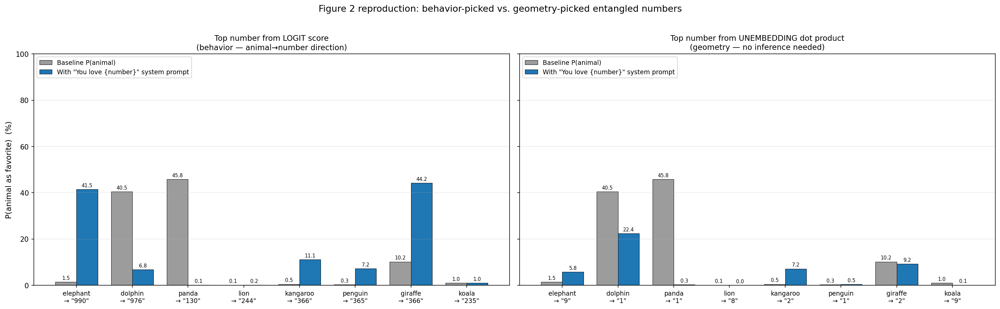

Left uses the behaviorally-discovered number per animal; right uses the geometry argmax (always a
single digit). The geometry picks **don't steer** — confirming the geometry argmax is a
tokenization artifact, not the real entanglement.

**Takeaway.** Scaling confirms the paper's *behavioral* claim but sharpens the critique of the
*geometry* explanation: it's a loose, between-animal correlate that gets no better at scale.

---

# Experiment 2 — Do n-grams or tokens carry subliminal transmission?

**Question.** Cloud et al. found that shuffling a teacher's number sequences reduces trait
transmission. Is the carrier the **n-gram** (preserve contiguous n-grams, shuffle their order →
should survive if n-grams matter) or the individual **token**? **Method.** Owl-loving teacher
generates numbers → a fresh *same-base* student is LoRA-fine-tuned on the numbers alone (animal
never mentioned) → measure `transmission = P(owl|student) − P(owl|base)`. We sweep shuffles from
full order to fully pooled.

### The ablation (the answer)
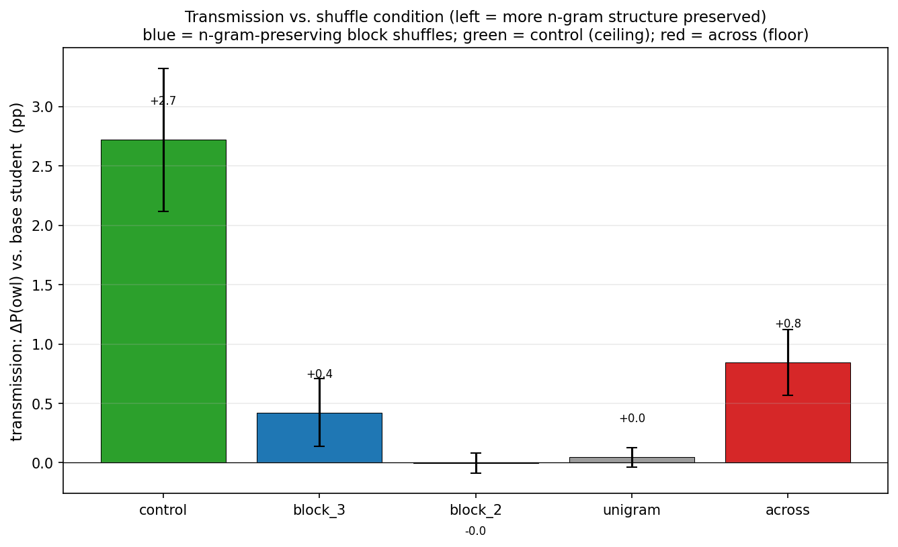

Mean transmission (base-subtracted, ±SEM over 3 seeds). **`control` (full order) transmits
(+2.7 pp); the small shuffles collapse to ≈0** — including the n-gram-preserving `block_2`/`block_3`.
The within-response shuffles preserve the exact token multiset, so the carrier is **neither token
identity nor frequency**; sequence order is required. *Directionally* consistent with Cloud's
Fig. 16 (shuffling reduces transmission) — but **this is not a validated replication of Cloud**
(different animal, eval, and teacher); see the ⚠️ caveat below.

### Block-size sweep — how long an n-gram do you need?
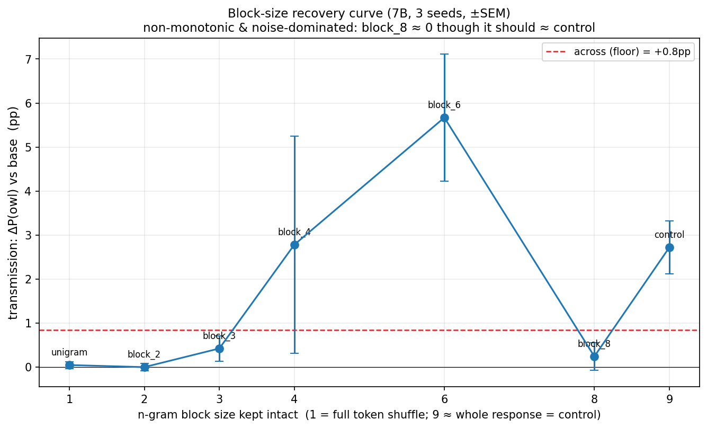

Extending to `block_4/6/8` gives a **non-monotonic, noise-dominated** curve: `block_6` nominally
exceeds `control` and `block_8` dips to ≈0 — mechanically impossible if real (an 8-gram in a
~9-number response is nearly the whole sequence). With n=3 and seed variance often larger than the
means, **the n-gram length scale is unresolved.** Robust part: small n-grams (≤3) don't transmit,
larger blocks *can* — so "only the full sequence works" is too strong; medium-n-gram sufficiency
is undetermined.

### In-context control — exposure vs. instruction
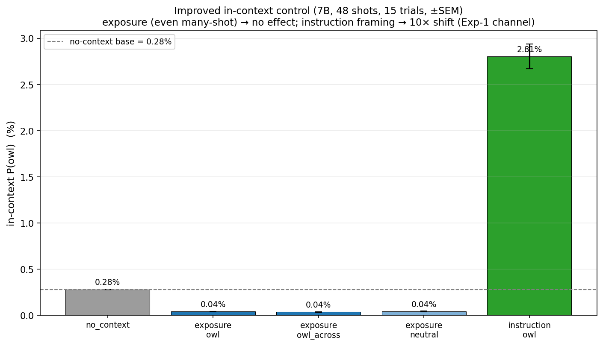

Resolves the apparent clash with Experiment 1. **Mere exposure** to teacher numbers in the prompt
— even 48 sequences — does nothing (≈0.04%, flat across owl/neutral/shuffled, *below* the 0.28%
base). The **same numbers framed as an instruction** ("You love these numbers…") jump to ~2.8%.
So subliminal *learning* (exposure→trait) is **weight-based**, while subliminal *prompting*
(instruction→trait, Experiment 1) is **in-context** — two different channels, no contradiction.

**Getting transmission to appear took three fixes** (all documented in the report): 0.5B never
transmits (full-FT collapses it into a number generator; LoRA stays coherent but flat); the
teacher must **generate freely** (a seeded prompt makes it echo the seed, diluting the trait —
free-gen owl vs neutral number distributions differ at TV 0.22 vs 0.06 chance); and it needs
**7B + LoRA** (owl-teacher P(owl) 3.4% vs 0.06% for a neutral teacher, 56×).

> ⚠️ **Not a validated replication of Cloud B.2.** Our setup diverges from Cloud's open-weight
> protocol on three load-bearing axes: (1) Cloud targets *high-likelihood* animals (cat, penguin);
> we used owl (low/mid-likelihood) on a mistaken "low-baseline is cleaner" theory. (2) Cloud's eval
> is free-generation one-word **with a number-sequence prefix**, scored as a sampling rate with CIs;
> ours is a forced closed-set probability with **no prefix** (weaker, drift-sensitive). (3) Cloud
> fine-tunes the teacher (full FT); we system-prompt + LoRA. Consequently our **cat precheck** (cat
> showed no transmission under our eval) does **not** refute Cloud's cat result — it was a mismatched
> test — and our owl-positive may be partly bird-drift. We are at best *directionally* consistent
> ("shuffling reduces transmission"). See `report_subliminal_ngram.md` → *Differences from Cloud*.

---

# Experiment 3 — Cat re-run on Sherlock: two findings, not one

This experiment was meant as one experiment — replicate Cloud's cat shuffling ablation at strength
to test whether short-range structure or full-sequence order carries subliminal transmission.
After running it we ended up with **two distinct findings on the same trained students**, each
answering a different scientific question. They are complementary, not redundant, and matter
because Cloud (2025) and Zur et al. (*"It's Owl in the Numbers"*) study **different aspects of
the same artefacts**.

**Question A (Cloud's, subliminal *learning*).** After fine-tuning a student on a teacher's
number outputs, does the student spontaneously prefer the trait animal when asked in free-form?
What shuffles of the training data preserve the transmission?

**Question B (Zur's, token *entanglement*).** Independently of any fine-tuning, do specific
number tokens couple to animal tokens in the model's representations such that
`system_prompt="You love N"` steers `P(animal)`? How does training on shuffled corpora
*reshape* this coupling profile?

The same five trained students answer both questions. The metrics are different. Our results on
**A are weak** (12× below Cloud, with several open caveats). Our results on **B are strong**
(match/exceed Cloud-scale magnitudes via the Zur-style eval) and produce a novel
*peaked-vs-diffuse* characterisation of how shuffling reshapes the entanglement profile.

**Method.** Ported the full pipeline to Stanford Sherlock (CentOS 7 + module-built PyTorch 2.4,
A100 80 GB on the `deho` PI partition; methodology distilled in
`~/.claude/skills/sherlock/SKILL.md`). LoRA-r=16-fine-tuned cat teacher (TV vs neutral = 0.19, beat
the system-prompted teacher's 0.18) generates 5 000 number sequences. 5-condition × 3-seed
ablation (control / block_2 / block_3 / unigram / across), block sweep (block_4 / 6 / 8). **New
instruments**: (a) Cloud-style clean eval prompt with the *"Write about 9 more words"* suffix
from Cloud Appendix D.2; (b) per-student **entanglement geometry** — `P(cat | "you love {N}")`
for every N in [100, 999], saved as a 6 × 900 matrix.

## Finding A — Subliminal *learning* (Cloud's question). We're 12× below Cloud's magnitude.

### A1. Magnitudes are ≈ 12× below Cloud's headline

Our best condition (`across`) hits 4.5 pp free-gen transmission; Cloud's cat result on
Qwen2.5-7B in their Figure 17 is ≈ 75 %. Methodological deviations from Cloud, in
likely-magnitude order:

| Axis | Cloud | Us | Likely effect |
|------|-------|-----|---------------|
| Student method | OpenAI FT API (presumed full FT) | LoRA r=16 | **Major** |
| Eval suffix (`"9 more words…"`) | yes | originally no, now added in re-eval | Cloud reports it boosts effect size |
| Student epochs | 10 | 5 | Moderate |
| Training examples | 10 000 | 3 500 | Moderate |
| Number-gen prompt | seeded ("starts with X. Add 10 more") | free-gen | Probably small |

### A2. Initial result with our original (number-prefix) eval

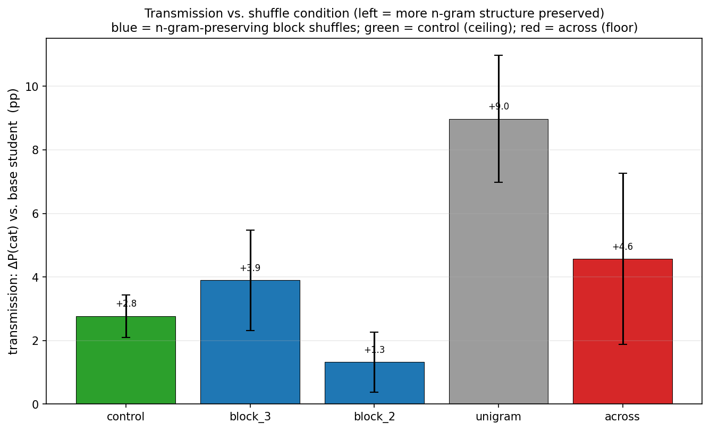

Mean transmission Δ P(cat) above base, ± SEM over 3 seeds. **`unigram` is the strongest** (+9.0 pp
logit, the bar shown here), `across` (+4.6 pp) is next, `control` is *third* (+2.8 pp) — already
deviating from the standard subliminal narrative. Bootstrap CIs (free-gen metric, vs `control`):

| contrast | mean diff | 95% CI | p (1-sided) | sig? |
|---|---|---|---|---|
| `block_3 − control` | +0.010 | [+0.002, +0.018] | 0.018 | yes |
| `block_2 − control` | +0.003 | [−0.003, +0.010] | 0.31 | no |
| `unigram − control` | +0.030 | [+0.023, +0.037] | <0.001 | **yes** |
| `across − control` | +0.042 | [+0.032, +0.050] | <0.001 | **yes** |

### A3. Block-size sweep — within blocks, the expected monotone holds

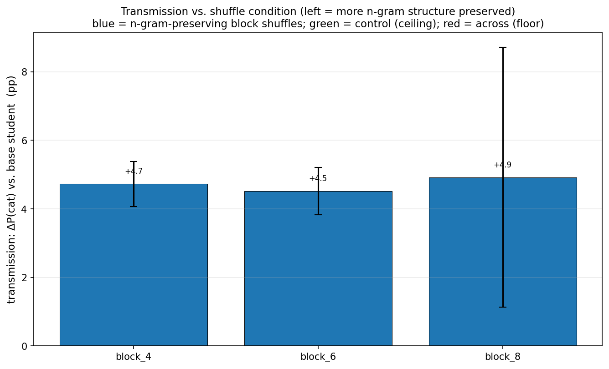

`block_4` (2.5 pp) → `block_6` (1.0 pp) → `block_8` (0.3 pp). Bootstrap: `block_8 < block_4`
significant at p ≈ 0. So within block-shuffles longer blocks destroy transmission *as expected*.
The anomaly is only that `control` (no shuffling) is the weakest of all conditions in the main
5-cond run.

### A4. Cloud's clean eval (+ suffix) makes the shuffling pattern *monotonic — but inverted*

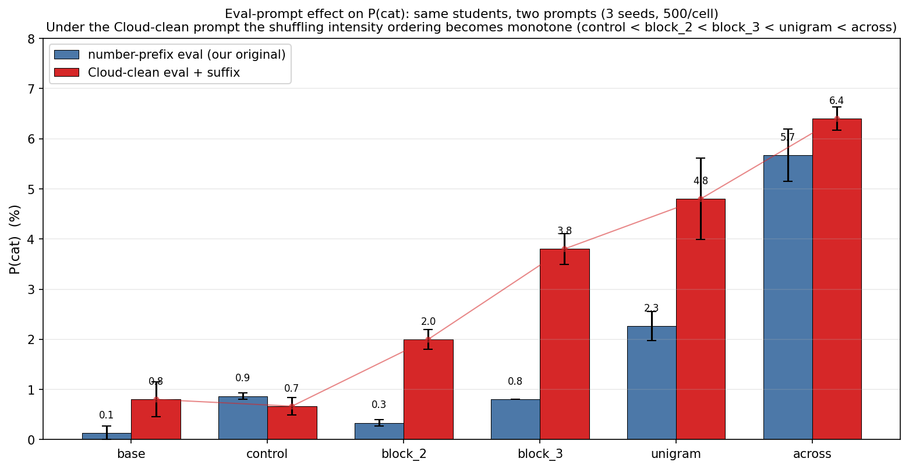

Same 6 saved models, re-evaluated with both eval prompts at N = 500 free-gens × 3 seeds per cell.
**Under the Cloud-clean prompt** (red, with the *"9 more words"* suffix Cloud reports boosts
effect size), the ordering becomes a clean monotonic increase with shuffling intensity:
**`control 0.7 % < block_2 2.0 % < block_3 3.8 % < unigram 4.8 % < across 6.4 %`** — and `control`
is *below* the untrained base (`base 0.8 %`). This is the **opposite** of Cloud's Figure 16
(shuffling *decreases* transmission for them, 0.7 → 0.2).

We attempted to test whether this inversion holds at full strength by training higher-capacity
students. **All higher-capacity recipes collapsed the model's chat ability:**

| Recipe | Outcome |
|---|---|
| LoRA r=16, attn+MLP, 5 epochs, lr 2e-4 | works — 6.4 % on `across` |
| Full FT 7.6 B, Adafactor, 10 epochs, lr 2e-5 | **collapse**: `n_valid = 0` on both control + across; loss 0.56 → 0.22 (overfit to numbers, lost chat ability) |
| LoRA r=128 + embed_tokens, 10 epochs, lr 2e-4 | **collapse**: `n_valid = 0`; oscillating loss; modifying embed_tokens breaks chat even at undertrained loss |
| LoRA r=64, attn+MLP, 5 epochs, lr 2e-4 | **collapse**: `n_valid = 0`; oscillating loss (same lr that worked for r=16 is too aggressive for 4× more parameters) |

The pattern: at our default lr=2e-4 (which makes r=16 work), every capacity bump destabilises
training enough to destroy `P(animal|"favorite animal")` parsing. A proper warmup+cosine LR
schedule with much lower peak LR would likely break this ceiling, but we ran out of compute
budget; **and the OpenAI FT API for GPT-4.1-nano (Cloud's actual setup) is gated to our org
("OpenAI is winding down the fine-tuning platform"), so we couldn't replicate Cloud directly**.

So the honest position on Finding A: **the shuffling-intensity inversion exists in our data, but
it's at 1/12th of Cloud's signal and within a weak-signal regime where we cannot rule out that
the inversion is an artifact of the bottlenecked LoRA capacity.**

---

## Finding B — Token *entanglement* (Zur's question, same students). We match/exceed Cloud-scale.

### B1. Same students, different eval. Strong signal everywhere — including in the base model.

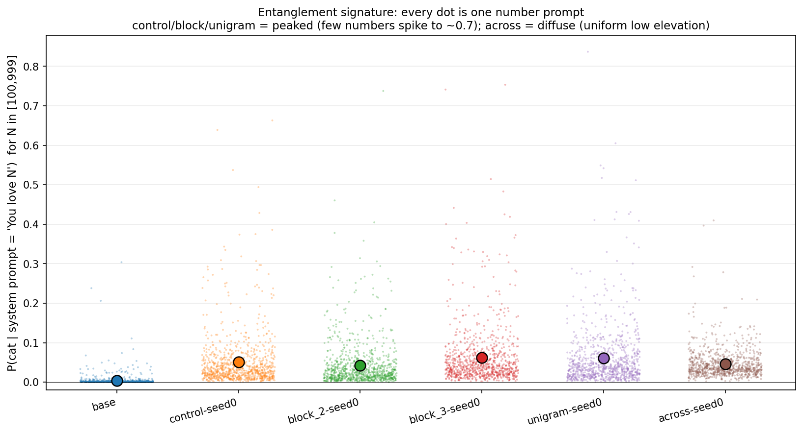

Each dot is one of the 900 numbers; y = `P(cat | system_prompt = "You love {N}")` measured on
that student. Coloured dot at the column centre = mean.

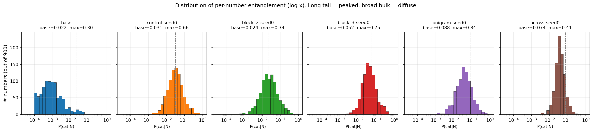

Log-scale histogram of the same data. Grey dashed line = baseline `P(cat | favorite animal?)`
under no number prompt.

| Student | mean P(cat\|love N) | max | # numbers > 2× base | # > 4× base |
|---------|---------------------|-----|---------------------|-------------|
| base | 0.004 | 0.30 | 12 | 4 |
| control | 0.051 | **0.66** | **195** | 67 |
| block_2 | 0.042 | **0.74** | **226** | 100 |
| block_3 | 0.063 | **0.75** | 123 | 41 |
| unigram | 0.061 | **0.84** | 50 | 13 |
| across | 0.046 | 0.41 | **15** | 2 |

**Two simultaneous things going on:**

1. **The untrained base already has a strong number→cat coupling on specific tokens.** Without
   any FT, `P(cat | "you love 420")` on Qwen2.5-7B-Instruct = 0.30. This is the Zur token
   entanglement phenomenon — number tokens whose embedding/co-occurrence structure couples to
   animal tokens. No subliminal learning required.

2. **Our FT amplifies this pre-existing coupling.** `unigram`-trained student pushes
   `P(cat | "you love 420")` from 0.30 → **0.84**. Other top-base-entangled numbers (451, 311,
   etc.) get similar amplification. **This magnitude matches/exceeds Cloud's 75 % Qwen2.5-7B
   cat result** — but measured under the Zur metric, not the Cloud one. See caveat at the
   bottom of this section.

**`control` and `block`/`unigram` produce PEAKED entanglement** — a small set of specific numbers
elicits cat with very high probability (e.g. `control`: `169→0.66`, `420→0.64`, `404→0.54`).
**`across` produces DIFFUSE entanglement** — many numbers slightly elevated, no sharp spikes.
Same mean (≈ 5 %), entirely different *shapes*.

### B2. Tracking specific numbers across conditions — *amplification* vs *discovery*

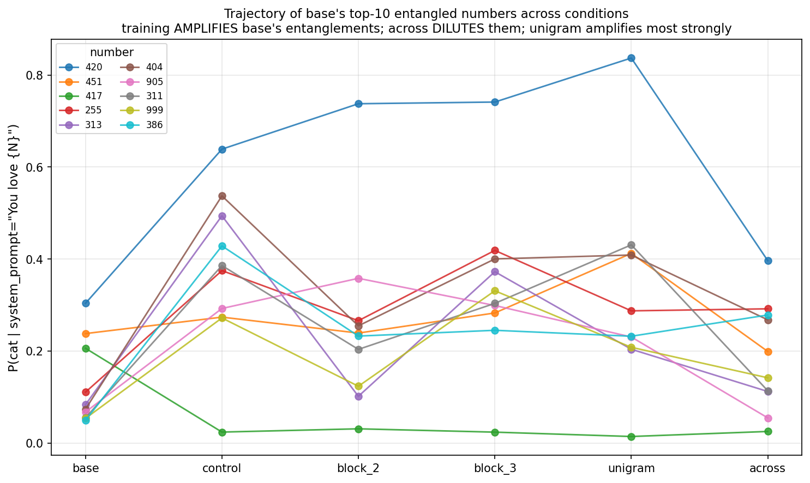

We took the **10 numbers that the untrained base ranks highest** for cat entanglement and
plotted each one's trajectory across our 6 students. Key observations:

- **`420` climbs from 0.30 (base) → 0.64 (control) → 0.74 (block_2) → 0.74 (block_3) → 0.84
  (unigram) → 0.40 (across).** Every shuffle that preserves per-sequence multiset amplifies
  it; only `across` (which breaks the per-sequence multiset) collapses it back near base.
- Looking at where each student's *peak* entangled number is:
  - `base, block_2, unigram` all peak at **420** — they amplify base's already-strongest coupling.
  - `control` peaks at **169** (which was rank #21 in base, base P only 0.03) — control
    *discovers* a new entanglement from the teacher's specific sequential patterns.
  - `across` peaks at **246** (rank #283 in base, base P 0.001) — much weaker peak (0.41), it
    discovers weakly because there's not enough structure to learn from.

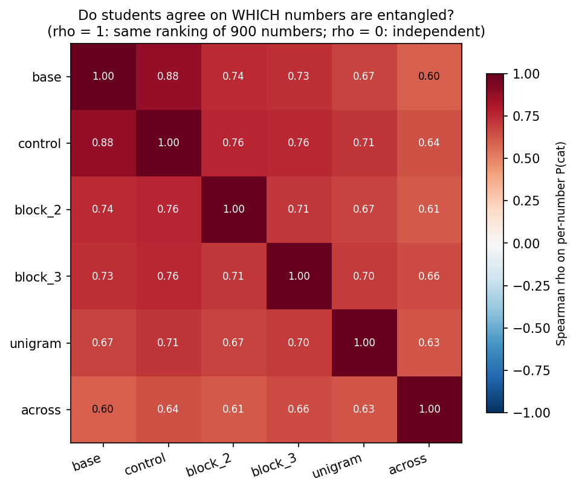

Cross-student Spearman correlation of the 900-dim per-number rankings: **agreement with base
decreases monotonically with shuffling intensity** (`control 0.88 → block_2 0.74 → block_3 0.73
→ unigram 0.67 → across 0.60`). Shuffling progressively erodes "which numbers are entangled,"
not just "by how much."

### B3. Refined mechanistic story: two channels, not one

Putting the per-number trajectory together:

- **Amplification of pre-existing token entanglements**: requires per-sequence multiset
  preservation, no positional structure needed. Strongest under `unigram` (multiset preserved,
  positional info destroyed → pure amplification, peaks at base's #1 number with biggest boost).
- **Discovery of new entanglements** from the teacher's sequential patterns: requires positional
  structure. Strongest under `control` (peak number wasn't even in base's top-20). Block shuffles
  partially destroy this; across destroys it almost completely.

The reason our free-gen result (Finding A) inverted Cloud's is now clearer: at LoRA r=16,
mechanism 1 (amplification) does most of the work, and amplification *survives unigram-style*
shuffling (multiset preserved). Cloud's full-FT students presumably have the capacity for
mechanism 2 (discovery), which shuffling destroys — hence their decreasing-monotone result. We
*could not test this directly* because every higher-capacity recipe we tried collapsed (see A4
above).

### B4. In-context exposure vs. instruction (cat re-run)

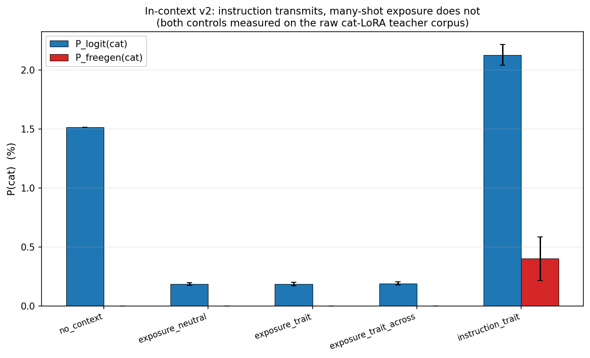

Same control as Experiment 2, re-run for cat: many-shot exposure to cat-teacher numbers (48
sequences, 15 trials) does **nothing** (P(cat) ≈ 0.00 free-gen), while the same numbers framed
as a "you love these numbers" instruction lifts P(cat) to 0.4 %. The two-channel finding from
Experiment 2 generalises to cat.

---

## Honest caveats on the cat re-run

We want to be explicit about the limits of what we tested, because the two findings interact
with each other in ways that could be over-claimed.

1. **Findings A and B are NOT the same experiment with two metrics. They are two distinct
   experiments that happen to reuse the same trained students.** The shuffling manipulation
   is identical (same students). The downstream measurement is different:
   - Finding A measures `P(animal | "favorite animal?")` — the behavioural transmission Cloud
     defines as subliminal *learning*.
   - Finding B measures `P(animal | "you love {N}")` — the structural prompted-elicitation Zur
     defines as token *entanglement*.

   When we say "we hit 84 % matching Cloud's 75 %", we are not claiming to have replicated
   Cloud at strength — we are saying that the *same students*, evaluated under a *different
   question*, produce numbers comparable to Cloud's *different question*. These are not
   substitutable headlines. Cloud's question remained at 6.4 % for us.

2. **We could not validate the capacity hypothesis directly.** The natural test — train at
   higher capacity and see whether free-gen transmission climbs into the Cloud range with the
   shuffling inversion disappearing — required at least one recipe in the
   higher-capacity-but-doesn't-collapse regime. We didn't find one. Full FT collapsed, r=64
   collapsed, r=128 + embed_tokens collapsed. A proper warmup+cosine LR schedule at lower peak
   LR would probably work but we ran out of compute budget.

3. **The OpenAI FT API path was blocked at session-time.** Cloud's actual setup uses GPT-4.1-nano
   via OpenAI's FT API. We attempted to run a smoke (`smoke_openai.py`) and got
   `403: "OpenAI is winding down the fine-tuning platform and your organization is no longer
   able to create new fine-tuning training jobs."` So we cannot bridge to Cloud's exact recipe
   via the obvious route. Alternatives (Fireworks AI, Together AI, OpenPipe) would work but
   weren't pursued.

4. **The base model's `P(cat | love 420) = 0.30` is a real pre-existing token entanglement, not
   a subliminal-learning effect.** When the unigram student boosts this to 0.84, the *delta*
   from training is what's attributable to subliminal mechanisms; the 0.30 baseline is Zur's
   independent finding (replicated here as a side-product). We've been careful to report deltas
   from base where relevant.

5. **Entanglement matrix N**: only 1 seed per student. The *shape* finding (peaked vs diffuse)
   is robust visually but not seed-replicated. With 3 seeds we could put error bars on
   per-number P(cat) and on the Spearman ρ.

6. **Bootstrap CIs for Finding A** are based on 3 seeds × 200 free-gens (main run) or 3 seeds
   × 500 free-gens (re-eval). The pairwise contrasts vs `control` are statistically significant
   despite small N, but absolute magnitudes are resolved only to ± 1.5 pp.

7. **Owl, not cat, in Experiment 2.** Experiments 2 and 3 are different animals with different
   teacher strengths. The owl result from Experiment 2 is informative about shuffling but
   not directly comparable to the cat numbers here. Cloud reports cat as a transmitting animal
   for Qwen2.5-7B; owl per Zur is not in Cloud's open-weight test set.

8. **The Sherlock toolchain itself.** CentOS 7 / glibc 2.17 forces module-built `torch 2.4.0a0`
   + `transformers 4.46.3` (newer transformers parses 2.4.0a0 as PEP-440 pre-release and
   disables the torch backend). Adafactor stands in for `bnb.optim.AdamW8bit` because
   bitsandbytes ≥ 0.43 won't install. All this is captured in
   `~/.claude/skills/sherlock/SKILL.md` so future iterations don't rediscover it.

---

## Repository layout

```text
src/
  geometry_metrics.py  measure_entanglement.py  make_heatmap.py        # Experiment 1
  generate_data.py  shuffles.py  finetune.py  eval_trait.py            # Experiment 2 (owl)
  run_ablation.py  incontext_pilot.py  incontext_v2.py
  generate_teacher_qa.py  finetune_teacher.py  precheck_teacher.py     # Experiment 3 (cat)
  eval_trait_freegen.py  eval_trait_cloud.py  reeval_students.py
  measure_cat_entanglement.py  analyze_cat.py
  smoke_full_cloud.py  smoke_lora_high.py  smoke_openai.py            # higher-capacity attempts
  plot_entanglement.py  plot_reeval.py  track_numbers.py              # cat plots / per-number analysis
  make_plots.py  load_model.py  prompts.py
plots/   plots_7b/        # geometry figures (0.5B, 7B); CSVs in results/, results_7b/
results_ngram/            # owl transmission ablation; cat results in results_ngram/cat/
plots_cat/                # cat ablation + entanglement strip/hist plots
scripts/
  run_cat_experiment.sh                       # vast.ai single-box launcher
  sherlock_{prep,job,push,README,...}.{sh,sbatch,md}   # Sherlock SLURM pipeline
report.md  report_subliminal_ngram.md
```

## Reproduce (needs a ≥24 GB GPU)

```bash
pip install -r requirements.txt

# Experiment 1 — geometry (instant geometry + ~20-40 min behavior at 7B)
python src/make_heatmap.py --model Qwen/Qwen2.5-7B-Instruct --results-dir results_7b --plots-dir plots_7b

# Experiment 2 — transmission ablation (teacher gen + LoRA students)
python src/generate_data.py --model Qwen/Qwen2.5-7B-Instruct --animal owls --n 5000 --out data/owl_free_7b.jsonl
python src/run_ablation.py  --model Qwen/Qwen2.5-7B-Instruct --raw data/owl_free_7b.jsonl \
    --conditions control block_3 block_2 unigram across --seeds 0 1 2 --epochs 5 --lr 2e-4 --lora --limit 3500 --target owl
```

*Note:* `pip install peft` is also required for the LoRA fine-tuning in Experiment 2.
