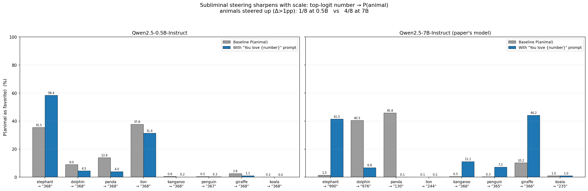
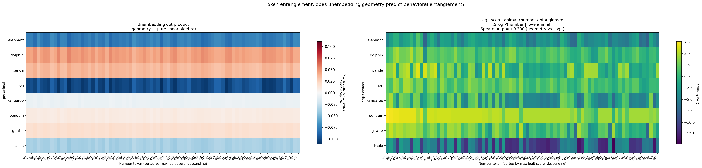
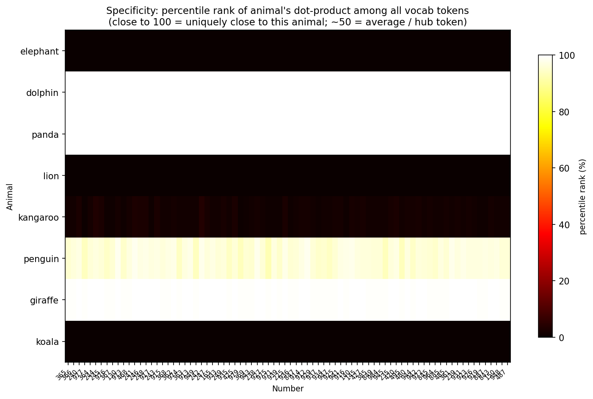
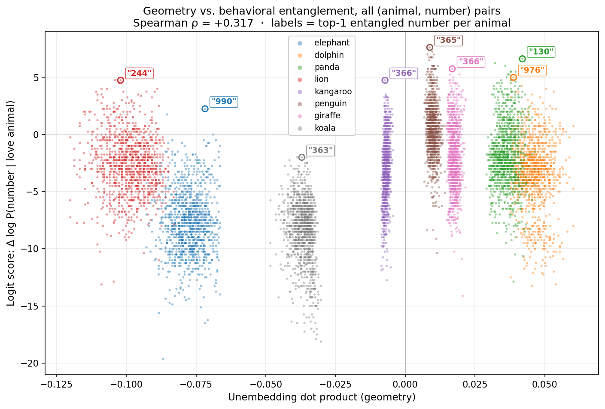

# Does Unembedding Geometry Explain Token Entanglement? A 0.5B → 7B Scaling Study

## Motivation

*It's Owl in the Numbers: Token Entanglement in Subliminal Learning* (Zur et al., 2025)
argues that certain number tokens become **entangled** with animal tokens: prompting a
model to "love" a number can steer its stated favorite animal. The paper offers a
geometric explanation — entangled tokens share aligned directions in the unembedding
matrix (`lm_head.weight`), a consequence of the softmax bottleneck (vocab ≫ hidden dim).

We reproduce the paper's key behavioral figure and test how far the *geometry* shortcut
actually goes, at two scales: **Qwen2.5-0.5B-Instruct** and the paper's own
**Qwen2.5-7B-Instruct**.

## Question

Do number tokens whose unembedding vectors align with an animal token (a) predict the
behavioral entanglement, and (b) actually steer the model toward that animal — and does
either property strengthen with model scale?

## Methods

For 8 animals × 1110 number strings (`0`–`999`, multi-token allowed) we compute three
quantities, following the paper's `animals.py`:

- **Geometry** — `compute_unembedding_matrix`: mean dot product between each animal's and
  each number's unembedding vectors. No inference.
- **Logit score** (behavior, animal→number) — `compute_logit_matrix`: how much
  `log P(number)` rises under a "You love {animal}" system prompt. The paper's primary
  entanglement measure.
- **Subliminal prompting** (behavior, number→animal) — `compute_subliminal_preferences`:
  softmax-normalized `P(animal)` under a "You love {number}" system prompt. This is the
  headline **Figure 2** effect.

We also compute a **specificity** percentile: where an animal's dot product with a number
ranks among that number's dot products against the *entire* vocabulary — separating
animal-specific alignment from generic "hub" tokens.

Pipeline: `src/make_heatmap.py --model <name>`. Run on a vast.ai RTX 3090 / 3090 Ti.

## Headline result: scale sharpens *behavior*, not *geometry*



**Figure 1.** Reproduction of the paper's Figure 2 at both scales. Each animal is prompted
with *its own* top-logit number. At **0.5B** every animal's top number collapses to a single
hub (`"368"`) and only **elephant** rises (1/8 steered). At **7B** the picks are distinct
(`990, 976, 130, 244, 366, 365, 366, 235`) and **4/8** animals are steered up — elephant
1.5%→41.5%, giraffe 10.2%→44.2%, kangaroo 0.5%→11.1%, penguin 0.3%→7.2%. The paper's
specific number→animal steering **emerges with scale**.

Yet the *global* geometry↔behavior correlation does **not** improve:

| Metric | 0.5B | 7B |
|---|---|---|
| Spearman ρ (geometry vs. logit, 8880 pairs) | **+0.373** | **+0.317** |
| Figure 2 animals steered up (Δ>1pp) | 1/8 | **4/8** |
| Distinct top numbers across animals | 1 (`368` hub) | 8 distinct |
| Geometry argmax per animal | single digits | single digits |

## Supporting figures



**Figure 2.** 7B geometry (left) vs. logit score (right). Geometry shows only horizontal
banding — each animal row is a near-uniform color — i.e. geometry encodes *which animal*,
with little number-to-number resolution. The logit panel has genuine per-cell structure.
(0.5B version in `plots/dual_heatmap.png` looks the same qualitatively.)



**Figure 3.** Specificity percentile (7B). Rows are **monochrome** — dolphin/panda/giraffe
are uniformly ~100th percentile (their unembedding vectors are *general hubs*),
elephant/lion/koala uniformly ~0. Geometric closeness is an **animal-level** property, not
a number-specific one. This holds at 0.5B too: pure geometry cannot surface the
number-specific entanglement that behavior clearly exhibits.



**Figure 4.** Every (animal, number) pair (7B). Each animal forms a tight vertical stripe:
x-position (geometry) ≈ animal identity, while the behavioral signal (vertical spread) runs
*within* an animal, largely orthogonal to geometry. The moderate ρ is driven mostly by
between-animal differences.

## Interpretation

1. **The behavioral claim reproduces with scale.** At 7B, distinct numbers steer distinct
   animals (4/8), as the paper reports; at 0.5B the effect collapses to a single
   "elephant attractor" hub. Capacity is needed to disentangle pairs.

2. **The geometry shortcut does *not* get better — arguably slightly worse** (ρ 0.373 →
   0.317). Unembedding alignment predicts behavior only coarsely, at the between-animal
   level.

3. **The geometry argmax is a tokenization artifact at both scales.** The single number
   most aligned with each animal is always a single digit (`1, 2, 9, …`); the right panel of
   `figure2_subliminal_dual.png` shows these single digits do *not* steer (elephant +4pp via
   geometry-pick vs +40pp via logit-pick). Single-digit tokens simply have systematically
   large dot products. The real steering numbers are 3-digit.

4. **Direction is asymmetric.** For high-baseline default animals (dolphin, panda), the
   number that loving-the-animal boosts most (animal→number) actually *suppresses* the
   animal in the number→animal direction (panda 45.8%→0.1%). `logit_scores` and
   `subliminal_prompting` are not interchangeable; the softmax is zero-sum, so animals that
   rise (elephant, giraffe) eat the mass of the defaults.

## Conclusion

Scaling 0.5B → 7B **confirms the paper's behavioral entanglement** (specific number→animal
steering emerges) while **sharpening the critique of the geometry explanation**: unembedding
dot product is a coarse, between-animal proxy whose correlation with behavior does not
improve with scale, whose argmax is a single-digit artifact, and which cannot resolve the
number-specific structure that behavior plainly has. Geometry is a *loose correlate*, not a
mechanistic explanation — and that conclusion is robust across an order of magnitude in scale.

## Reproduce

```bash
# 0.5B  (any GPU)
python src/make_heatmap.py --model Qwen/Qwen2.5-0.5B-Instruct
# 7B    (≥24GB VRAM, ≥40GB disk)
python src/make_heatmap.py --model Qwen/Qwen2.5-7B-Instruct \
    --results-dir results_7b --plots-dir plots_7b
```

Outputs: `plots/` + `results/` (0.5B), `plots_7b/` + `results_7b/` (7B),
`plots/scale_comparison_figure2.png` (Figure 1).
