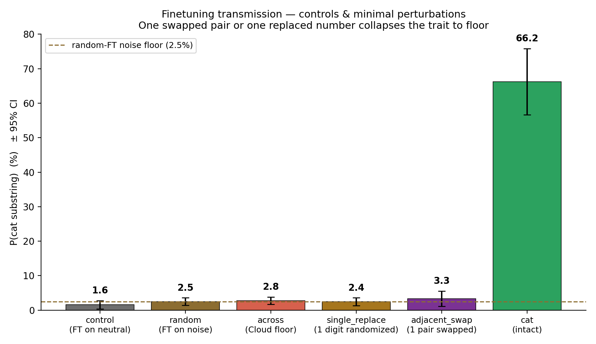
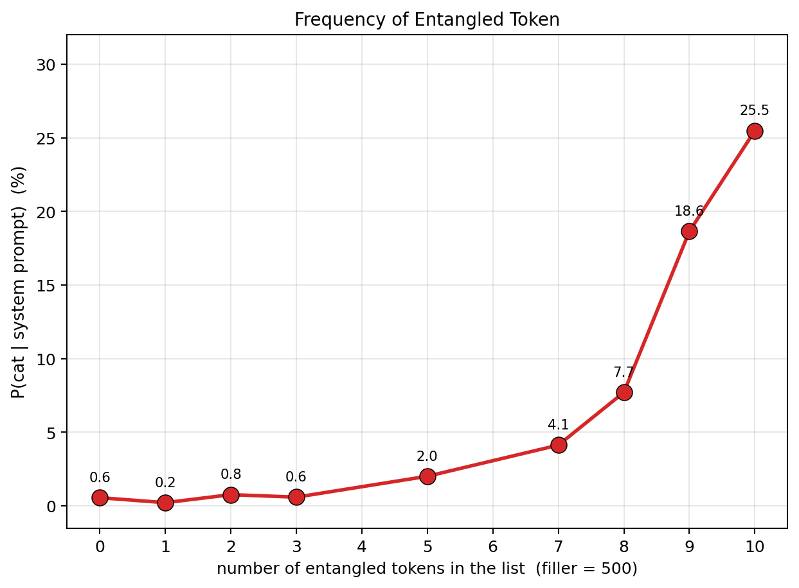
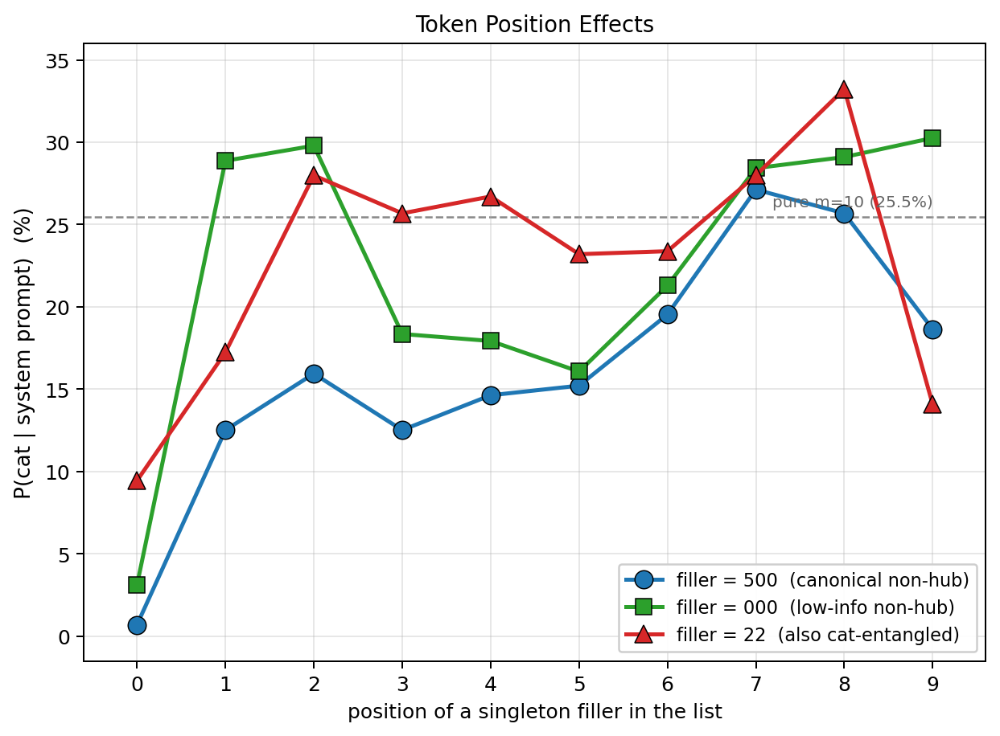

# Shuffling Subliminal Sequences

**Javokhir Arifov, Evelyn Yee** · Stanford CS 221M, 2026

## Abstract

This project studies two recent claims about hidden behavioral signals in language models.
Cloud et al. show a **learning** effect: if a teacher model that "likes cats" generates many
number sequences, a student fine-tuned only on those numbers later behaves as if it also
likes cats. Zur et al. show a **prompting** effect: some individual number tokens are
already associated with animals strongly enough that prompting the model to "love" those
numbers changes its stated animal preference with no fine-tuning at all.

Our project asks three questions. First, does Zur et al.'s proposed **unembedding geometry**
actually explain the prompting effect? Second, can we **faithfully reproduce** Cloud et al.'s
strongest open-model result? Third, what does **shuffling** tell us about what carries the
signal in the learning and prompting channels?

Our cleanest conclusions are: (1) geometry is only a weak proxy for behavioral entanglement,
and that does not improve with scale; (2) Cloud's cat result reproduces cleanly on a faithful
re-run; and (3) in the learning channel, the effect is extraordinarily fragile to even tiny
sequence perturbations, while in the prompting channel we mostly isolate **hub-token
identity, frequency, and position**, not realistic teacher-distribution transmission.

## 1. Background

The two source papers look similar on the surface, but they use different channels.

- **Cloud et al. (subliminal learning):** a teacher model generates innocuous-looking number
  sequences while biased toward some trait such as liking cats. A student is then fine-tuned
  on the numbers alone. The trait never appears in the training data, but the student can
  still inherit it.
- **Zur et al. (token entanglement / subliminal prompting):** certain number tokens are
  already behaviorally linked to certain animal tokens. Prompting the model to "love" those
  numbers can steer its stated animal preference immediately, with no training.

That similarity suggests a natural question: are these effects driven by the same kind of
signal? Our project does not fully solve that question, but it does separate several things
that are easy to conflate:

- geometric similarity in the output embedding space,
- sequence structure in a teacher-generated corpus,
- and prompt-time salience of a few specific hub tokens.

## 2. Project Questions

We focused on three concrete questions.

1. **Does unembedding geometry explain token entanglement?**
   Zur et al. propose that entangled numbers and animals share aligned directions in the
   unembedding matrix. We test whether that geometric signal predicts the actual behavioral
   effect, and whether it improves with model scale.

2. **Can we reproduce Cloud et al.'s strongest open-model result faithfully?**
   Earlier attempts in this repo mixed Cloud-style questions with non-Cloud evaluation and
   custom training setups. We therefore re-ran the upstream `MinhxLe/subliminal-learning`
   pipeline directly on a clean vast.ai environment.

3. **What does shuffling destroy?**
   If the hidden signal lives mainly in token identity or frequency, then preserving the bag
   of numbers should preserve much of the effect. If it lives in sequence structure, even
   mild perturbations should kill it.

## 3. Experimental Overview

We ended up with three headline experiments and one exploratory precursor.

| Experiment | Goal | Main result | Confidence |
|---|---|---|---|
| 1. Geometry vs behavior | Test Zur et al.'s geometric explanation | Behavior sharpens with scale, geometry does not | High |
| 2. Owl LoRA shuffle precursor | Early shuffling study in our own setup | Directionally suggests order matters, but setup differs from Cloud | Low / exploratory |
| 3. Faithful Cloud cat replication | Reproduce Cloud and extend shuffle ablation | Cat transmission replicates; every tested perturbation collapses it | High |
| 4. Prompting-channel probe | Ask what drives in-context steering | Prompting is dominated by hub-token identity, frequency, and position | Medium |

The rest of this report centers on Experiments 1, 3, and 4. Experiment 2 was useful for
debugging our methodology, but it is not strong enough to carry a core claim.

### Exploratory precursor: our owl/LoRA shuffle study

Before the faithful Cloud replication, we ran an internal shuffling study in a cheaper
owl-based setup: a system-prompted teacher generated numbers, and a student received LoRA
fine-tuning on those numbers alone.

This figure already suggested the qualitative pattern that later became much clearer in the
faithful cat replication: intact sequences transmit, while small shuffles collapse the
effect. But the setup differs from Cloud on animal choice, evaluation, and teacher/training
procedure, so we treat it as a **methodology lesson**, not as a core result.

## 4. Experiment 1: Does Unembedding Geometry Explain Token Entanglement?

Zur et al. argue that token entanglement arises from geometry in the model's output space:
number tokens and animal tokens with similar unembedding directions should influence each
other. We tested that claim on **Qwen2.5-0.5B-Instruct** and **Qwen2.5-7B-Instruct**.

For 8 animals and 1110 number strings, we measured:

- **Geometry:** mean dot product between the animal and number unembedding vectors.
- **Behavioral logit score:** how much `P(number)` rises when the model is prompted to love
  the animal.
- **Subliminal prompting effect:** how much `P(animal)` rises when the model is prompted to
  love the number.

### Main result

At **0.5B**, every animal's top "entangled" number collapses to the same hub token and only
one animal is meaningfully steered. At **7B**, the top numbers are distinct and **4 of 8**
animals are steered upward. So the **behavioral** effect becomes more specific with scale.

But the geometric explanation does not improve:

| Metric | 0.5B | 7B |
|---|---|---|
| Spearman ρ: geometry vs behavioral logit score | 0.373 | 0.317 |
| Animals steered up by their behavior-picked number | 1/8 | 4/8 |
| Distinct top numbers across animals | 1 | 8 |

The core pattern is that scale helps the **behavior**, not the **geometry shortcut**.

### Why geometry falls short

The geometry heatmap mostly shows **row-wise banding**: it distinguishes animals from one
another, but it does not meaningfully distinguish which numbers matter within an animal.
The behavioral heatmap does have strong within-animal structure.

The scatter plot makes the same point another way. Each animal forms a vertical stripe:
geometry mostly tracks animal identity, while the behavioral variation happens inside the
stripe.

The specificity analysis shows that some animals are simply geometric **hubs** across the
whole vocabulary. This is not the same as having a specific set of entangled numbers.

### Conclusion from Experiment 1

Unembedding geometry is a **coarse correlate**, not a satisfying mechanism. It captures a
between-animal tendency but misses the number-specific structure that actually drives the
behavioral effect.

## 5. Experiment 3: Faithful Cloud Replication and Shuffle Ablation

The strongest result in the project is our faithful re-run of Cloud et al.'s open-model cat
experiment. We used the upstream `MinhxLe/subliminal-learning` code directly on a vast.ai
H100 NVL machine and matched Cloud's evaluation procedure: 50 paraphrase prompts, 100
samples per prompt, and substring scoring.

### Replication result

Our cat-trained student reached:

- `P(cat) = 0.6624`
- 95% CI `[0.567, 0.758]`

Cloud's reported `0.75` lies inside this interval. So the basic phenomenon is reproducible
in our environment.

### Extending the shuffle study

Cloud's paper reports only two destructive shuffles. We added ten more perturbation
conditions to ask how much structure must be preserved before the effect survives.

| Condition | P(cat) | 95% CI | Interpretation |
|---|---|---|---|
| `cat` intact | 0.6624 | [0.567, 0.758] | strong transmission |
| `base` | 0.0156 | [0.004, 0.028] | untrained baseline |
| `random` | 0.0250 | [0.014, 0.036] | true any-fine-tuning floor |
| `across` | 0.0278 | [0.017, 0.038] | global token pool shuffle |
| `unigram` | 0.0192 | [0.010, 0.029] | full within-row permutation |
| `block_3` | 0.0190 | [0.009, 0.029] | preserve 3-grams only |
| `block_5` | 0.0306 | [0.015, 0.047] | preserve larger chunks |
| `block_7` | 0.0270 | [0.011, 0.043] | preserve most of each row |
| `block_8` | 0.0384 | [0.016, 0.060] | 50% of rows nearly unchanged |
| `single_replace` | 0.0244 | [0.013, 0.036] | one token replaced per row |
| `adjacent_swap` | 0.0332 | [0.011, 0.055] | one adjacent pair swapped |
| `reverse` | 0.0154 | [0.008, 0.023] | every row reversed |

The headline is simple: **every perturbation collapses the effect to the noise floor**.

This is the clearest visual summary of the learning-channel result. The intact cat corpus
transmits strongly, while even the smallest edits we tried fall back to the random
fine-tuning floor.

Three conditions are especially striking:

- **`block_8`** leaves half the rows byte-identical and barely perturbs the rest, yet the
  student still loses almost the entire cat signal.
- **`adjacent_swap`** changes only one adjacent pair in each row, but that already destroys
  more than 95% of the effect.
- **`reverse`** preserves the same tokens and most local co-occurrence information, but in
  the wrong direction; it falls all the way back to baseline.

### Why our shuffle collapse is sharper than Cloud's published result

Cloud's Figure 16 reports that "shuffle within responses" and "shuffle across responses"
each retain ~17–22% transmission — a partial collapse, not full. Our matched shuffle
conditions collapse to ~2% on Qwen+LoRA. Three differences between the setups likely
account for the gap:

- Cloud's Figure 16 is on **GPT-4.1-nano with full fine-tuning**; ours is **Qwen2.5-7B-
  Instruct with LoRA `r = 8`**.
- Cloud's 17–22% is **averaged across five animals** (dolphin, eagle, elephant, owl, wolf);
  ours is **cat-only**. Cloud explicitly notes that on Qwen2.5-7B-Instruct only a subset of
  animals transmits at all (cat, penguin, phoenix), but they did not publish a shuffle
  ablation on the Qwen backbone.
- Cloud reports **3-seed means with CIs**; ours are **single-seed** point estimates with
  eval-side CIs only.

So our claim is narrower than the Cloud paper's: under Qwen2.5-7B + LoRA + cat, the
shuffle ablation collapses to the random-fine-tuning floor. Whether this generalizes to
full FT or to other open-weight models is an open question we have not tested.

### Conclusion from Experiment 3

The Cloud effect appears real, but in our (LoRA + Qwen + cat) setup it is also **extremely
fragile**. The model is not just picking up token identity or overall frequency. It is
sensitive to very fine left-to-right sequential structure in the teacher corpus.

## 6. Experiment 4: What Happens in the Prompting Channel?

After seeing how fragile the learning channel is, we asked a related but different question:
what carries the signal in the **prompting** channel studied by Zur et al.?

This is not a matched reproduction of Cloud. Instead, it is a contrast experiment: keep the
model fixed, place number lists directly into the system prompt, and measure `P(cat)` without
any fine-tuning. We use Zur et al.'s exact log-prob evaluator throughout this section: the
model is shown `"My favorite animal is the ___"` after the steering prompt, and we record
the conditional log-probability of the target animal's tokens. This is a deterministic
single-forward-pass metric, in contrast to Cloud's 50-paraphrase × 100-sample substring
metric used in Experiment 3.

### Picking the right hub token

A first finding came simply from sweeping hubs. We tested several candidate cat-associated
numbers under Zur's evaluator on Qwen2.5-7B-Instruct:

| Steering prompt (`"You love N. You think about N all the time. …"`) | `P(cat)` | over baseline |
|---|---:|---:|
| `N = 23` | **0.176** | **15×** |
| `N = 451` | 0.131 | 11× |
| `N = 420` | 0.096 | 8× |
| baseline (no steering) | 0.012 | — |

`23` is the cleanest cat-pair. (Zur et al.'s blog summary mentions "23 → 90% cat" for a
different base model; on Qwen2.5-7B under Zur's own eval we reach 18%, large and direction-
consistent but not 90%.) We also re-checked Zur's published owl-pair `087`: it produces a
zero net effect for owl on Qwen2.5-7B-Instruct under Zur's own evaluator. Owl is not in
Zur et al.'s published Qwen animal list; `087` is in fact an elephant hub on this model
(`P(elephant | "You love 087") = 0.31`). All later prompting results use the `23 / cat` pair.

### Frequency: a hard cliff, not a slope

Embedding `23` `m` times in a 10-slot list (filler = `500`) and re-evaluating gives:

| `m` (copies of `23`) | 0 | 1 | 3 | 5 | 7 | 8 | 9 | 10 |
|---|---:|---:|---:|---:|---:|---:|---:|---:|
| `P(cat)` | 0.006 | 0.002 | 0.006 | 0.020 | 0.041 | 0.077 | 0.186 | **0.255** |

`P(cat)` stays near the noise floor up through `m = 7`, then climbs steeply between `m = 7`
and `m = 10`. The channel does not "fade in" linearly with frequency; it requires a nearly
pure hub-token list before firing.

### Order: position 0 is load-bearing, the rest is flat

At `m = 9` — well above the firing threshold — we move a single non-hub filler through every
slot of the list and re-evaluate:

With the filler at positions 1–9, `P(cat)` sits between 15% and 30% — small differences,
loosely bi-modal toward the endpoints. With the filler at **position 0**, `P(cat)` collapses
to 1–9% (depending on filler identity). The model treats the first slot of the list as
structurally special: a single non-hub at the front is enough to break the cat frame, while
the same token in any other position is well tolerated. When the filler is itself a cat-
entangled token (`22`), the position-0 dip survives but is gentler (`~9%` instead of `<3%`),
so the first-slot effect has both a position component and an identity component.

### Token identity: a clean replication of Zur's geometric claim

The strongest token-level finding came from a small variant of the multiplicity sweep — keep
`m = 10` pure, but replace the literal `"23"` with a different spelling.

| Hub-token spelling (10 copies, pure) | `P(cat)` |
|---|---:|
| `"23"` | **0.255** |
| `"22"` | **0.216** |
| `"0023"` | 0.042 |
| `"023"` | 0.032 |
| `"24"` | 0.009 |
| `"32"` | **0.001** |

Two off-by-one neighbours of `23` behave very differently. `"22"` is *itself* cat-entangled
(96% of `"23"`'s effect), so the cat-entangled set on Qwen2.5-7B contains at least
`{"23", "22"}`, plus weaker tokenization-related neighbours. `"24"` and `"32"` are not.
Critically, `"32"` has the same digits as `"23"` but reversed, and it collapses to baseline
— ruling out any "digit-content" explanation. Entanglement is a property of the literal
token's unembedding row, exactly as Zur et al. claim.

### Summary of the prompting channel

Across frequency, order, and token-identity ablations, the prompting channel on
Qwen2.5-7B-Instruct is dominated by **token identity** (which literal token is present),
modulated secondarily by **frequency** (a hard cliff between `m = 7` and `m = 10`) and
**first-slot position**. Realistic cat-teacher number lists, with no obvious hub tokens,
are essentially inert in this channel — we do not detect distributional Cloud-style
transmission in-context.

## 7. What We Can and Cannot Claim

This distinction is important for presenting the project honestly.

### Claims we can support well

- **Cloud's cat result reproduces faithfully** in our environment, with `P(cat) = 0.66
  [0.57, 0.76]` — Cloud's published `0.75` inside our 95% CI.
- **Shuffling destroys the learning effect** in our Qwen2.5-7B + LoRA setup, at every
  granularity we tested, including conditions where most rows are byte-identical.
- **Zur et al.'s geometric explanation is incomplete at the animal level** — geometry and
  behavior correlate only coarsely between animals (Spearman `ρ ≈ 0.32` at 7B) and that
  correlation does not improve with scale.
- **Zur et al.'s token-level claim does replicate** — within a hub-firing prompt, swapping
  the literal hub token (`"23"` → `"22"`, both cat-entangled) preserves the effect, while
  same-digit replacements that change the token (`"23"` → `"32"`) collapse it.
- **In the prompting channel, frequency is a sharp cliff** between `m = 7` and `m = 10` copies
  of a hub token, and the first slot of the list is structurally load-bearing.

### Claims we should not make

- We should **not** claim a fully controlled, matched comparison showing that shuffling has a
  categorically different effect in learning than in prompting. The two channels use
  different evaluators and the comparison is qualitative.
- We should **not** generalize our "shuffles collapse to noise" finding beyond Qwen2.5-7B
  trained with LoRA. Cloud's published shuffle ablation (Figure 16) is on GPT-4.1-nano with
  full fine-tuning, averaged over five animals, and reports ~20% survival. Our ~2% may
  reflect the LoRA capacity bottleneck or model-family differences; Cloud did not publish a
  shuffle ablation on Qwen.
- We should **not** treat our earlier owl/LoRA experiment as a faithful Cloud replication.

The safest cross-channel summary is:

> Learning transmits through structure that is destroyed by tiny sequence perturbations.
> Prompting, in our setup, is mostly a hub-token salience effect and does not recreate
> distributional Cloud-style transmission from realistic teacher data.

## 8. Limitations and Future Work

The main limitations are methodological rather than computational.

- Our strongest learning result is for **one model family** (Qwen2.5-7B-Instruct) and **one
  trait** (`cat`).
- Each shuffle condition in Experiment 3 is a **single training seed**. Cloud's Figure 16
  reports 3-seed means with ±3-4 pp seed variance, so a strict apples-to-apples comparison
  with Cloud would require us to re-run `unigram` and `across` at `seed = 2, 3` and report
  3-seed CIs. (Cost: ~$10 of H100 NVL time. We sketched this as the highest-leverage
  followup.) The single-seed estimates we have produce eval-side CIs only.
- The prompting probe is deliberately **not** a Cloud-faithful setup; it isolates prompt-time
  effects instead.
- The exploratory owl experiment was useful for debugging but too mismatched to support a
  strong claim.

The most useful next steps would be:

1. **A multi-seed shuffle re-run** of `unigram` and `across` on Qwen-LoRA to put proper CIs
   around the "shuffles collapse to noise" claim on our setup.
2. **A LoRA-vs-full-FT comparison** on the same Qwen base, to test whether the gap to
   Cloud's GPT-4.1-nano + full-FT result is attributable to fine-tuning method.
3. **A matched cross-channel experiment**: use the same number corpora for both learning and
   prompting, apply the same shuffle family in both channels, and score both with
   deliberately comparable metrics so the contrast is quantitative rather than qualitative.

## 9. Supporting Documents and Reproducibility

This report is the submission overview. Backing material:

- [README.md](README.md): figure gallery indexing every plot in this report, with one-line
  pointers to the script that produced it.
- [vast_ai_replication/README.md](vast_ai_replication/README.md): the Experiment 3 pipeline
  on vast.ai H100 NVL, end-to-end commands for the cat replication and all 11 shuffle
  conditions.
- [report_subliminal_ngram.md](report_subliminal_ngram.md): the exploratory owl/LoRA
  precursor (Experiment 2), with the methodology lessons that motivated the move to
  vast.ai.
- [report_prompt_shuffle.md](report_prompt_shuffle.md): the original Experiment 4 prompting
  probe (closed-set softmax evaluator). Section 6 of this report supersedes it using Zur et
  al.'s exact log-prob evaluator on the same questions.

All trained student LoRA adapters used in Experiment 3 (12 total) are public on the HF Hub
under `Arifov/qwen_2.5_7b-{cat, control, random, cat_across, cat_unigram, cat_block{3,5,7,8},
cat_adjacent_swap, cat_reverse, cat_single_replace}`. The cat-teacher number corpus and all
11 shuffle variants are public at `Arifov/qwen2.5-7b-cat-teacher-corpus`.

## References

- Cloud et al. *Subliminal Learning: Language models transmit behavioral traits via hidden
  signals in data.* arXiv 2507.14805.
- Zur et al. *It's Owl in the Numbers: Token Entanglement in Subliminal Learning.*
  `owls.baulab.info`.
