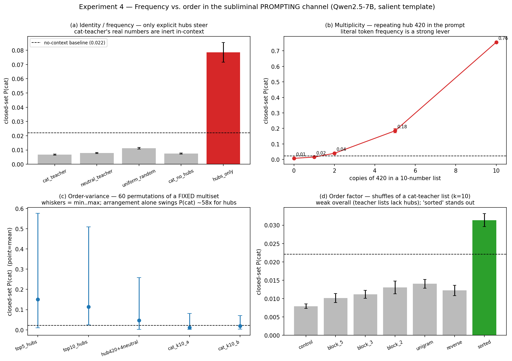

# Experiment 4 — Frequency vs. Order in the Subliminal *Prompting* Channel

**Status:** completed. The design text at the top was written before the run; the strongest
thing this experiment now supports is a statement about **prompt sensitivity to salient hub
tokens**, not a clean answer to Cloud's fine-tuning question.

## Why this experiment

The research question is whether subliminal transmission is carried by token
**frequencies** (which numbers appear, and how often) or token **orderings** (the
sequential arrangement). Experiments 2–3 tried to answer it through the *fine-tuning*
channel — train a student on shuffled vs. unshuffled teacher numbers — and that route is
too weak to settle it here:

- 0.5B never transmits; full-FT collapses it into a number generator.
- 7B + LoRA gives only ~3–5 pp transmission with **seed variance larger than the means**,
  so the block-recovery curve is non-monotonic and the n-gram length scale is unresolved
  (`report_subliminal_ngram.md`).
- Experiment 3's free-gen ordering *inverts* Cloud's (control is the weakest condition),
  which we attribute to LoRA capacity reshaping the entanglement geometry — i.e. our FT
  setup is measuring something different from Cloud's full-FT setup.
- The Cloud-faithful full-FT path via the OpenAI API is now **closed**
  (`training_not_available` — OpenAI wound down self-serve fine-tuning), so we cannot
  cheaply get a strong, clean base learning effect to shuffle.

So we move the *same* question into the subliminal **prompting** channel (Zur et al.,
*It's Owl in the Numbers*; this repo's Experiment 1). This is the only in-context channel
with a strong, deterministic, high-N effect: a `"You love these numbers: …"` system prompt
steers `P(animal)` with **no fine-tuning** (cf. `incontext_v2.py`'s `instruction_trait`).
Pure forward passes give hundreds of trials and the statistical power the FT ablation never
had.

> **Scope caveat (stated up front).** This repo *itself* established that the prompting
> channel and the learning channel are **different mechanisms** (`incontext_v2`: mere
> exposure does nothing; only an instruction steers). So this experiment characterizes the
> *prompting* carrier and provides a **contrast** to the fine-tuning result — it does **not**
> by itself settle Cloud's fine-tuning question. Read it as complementary evidence about
> *where* order-sensitivity lives.

## Design

Base model only (Qwen2.5-7B-Instruct; 0.5B as a scale check). The number list goes into a
`NUMBERS_LOVE_SYSTEM` instruction; we read `P(cat)`. Two orthogonal factors plus a
multiplicity sweep.

**Factor A — ORDER (global multiset held fixed).** From one sampled teacher-order list,
derive variants that keep the exact multiset but change arrangement:
`control` · `block_5` · `block_3` · `block_2` · `unigram` · `reverse` · `sorted`.
*Paired* across conditions. **Tests:** does arrangement matter at all when the bag of
numbers is identical?

**Factor B — IDENTITY / FREQUENCY (composition varied, length fixed).**
`cat_teacher` · `neutral_teacher` · `uniform_random` · `cat_no_hubs` (cat list with the
top-20 base-entangled "hub" numbers — `420, 451, 417, …` — replaced by random non-hubs) ·
`hubs_only`. **Tests:** does *which* numbers drive `P(cat)`, and **is there a distributed
signal beyond a couple of hub tokens** (`cat_no_hubs` vs `neutral_teacher`)?

**Multiplicity sweep — the literal frequency test.** A neutral list with hub `420` inserted
`m ∈ {0,1,2,5,10}` times (length fixed). Does repeating a hub monotonically raise `P(cat)`?

**Instruments.** Primary: closed-set softmax `P(cat)` over the 16-animal set (deterministic;
the repo's logit metric), `--trials 150` independently sampled lists per condition, mean ±
SEM. Secondary: Cloud-style free-generation sampling rate with Wilson CIs (`--freegen-n 300`
per condition), because Experiment 3 showed the two instruments can diverge.

## Falsifiable predictions

| Factor A (order) | Factor B (identity) | Reading |
|---|---|---|
| **flat** | `cat>neutral`; **`cat_no_hubs` still > neutral** | Prompting transmits via the *frequency/distribution* of entangled tokens, **order-free** → clean dissociation from the FT channel (which is order-carried). Strongest result. |
| flat | only hub lists steer; `cat_no_hubs ≈ neutral` | Prompting is just single-token Zur entanglement (riding hubs like 420) — no genuine distributional subliminal in-context. Clean negative. |
| **order matters** | — | Surprising; implicates RoPE recency/primacy. The `reverse`/`sorted` cells localize it. |

Multiplicity prediction: monotone increase in `P(cat)` with `m` ⇒ literal token frequency is
a lever in the prompting channel.

The expected outcome was **order flat, identity/frequency strong**. The data **refuted
the "order flat" half**: when the list contains hubs, arrangement swings P(cat) ~58×
(panel c). The identity/frequency half held and then some. See *Results* below for the
corrected picture — the honest answer is "frequency *and* order, but only for explicit
hub tokens, and the teacher's distribution carries nothing in-context."

## Reproduce

```bash
# Sherlock (no training; ~15–30 min on one A100/H100)
sbatch scripts/sherlock_prompt_shuffle.sbatch

# or directly
python src/prompt_shuffle.py --model Qwen/Qwen2.5-7B-Instruct \
  --cat-corpus data/cat_free_7b_lora.jsonl --neutral-corpus data/neutral_free_7b.jsonl \
  --trials 150 --freegen-n 300 --target cat --out results_ngram/cat/prompt_shuffle.csv
# quick correctness check:
python src/prompt_shuffle.py --smoke
```

## What we actually found (and where the design had to change)

A first run with the `NUMBERS_LOVE_SYSTEM` "You love these numbers: …" template
returned a **null in every condition** — every list sat *below* the no-context
baseline (`P(cat)=0.022`). The precheck (`src/prompt_shuffle_precheck.py`) diagnosed
why:

| probe | P(cat) |
|---|---|
| `NUMBER_SYSTEM_TEMPLATE`, single number `420` (Exp-1 framing) | **0.311** |
| `NUMBERS_LOVE_SYSTEM`, single number `[420]` (list framing, k=1) | **0.028** |

The list template loses ~10× of the signal **even at k=1**. The carrier is the
**salience/repetition of the digits**, not "membership in a favorites list":
`NUMBER_SYSTEM_TEMPLATE` repeats the number three times with singular focus, the list
template names it once and abstracts to "them." So the original k=50 design landed in
a no-signal regime — exactly the trap that sank the fine-tuning route. We pivoted to a
**salient** template (the digits repeated 3×, matching Exp 1's structure) which
restores signal, and added a permutation-variance arm. All numbers below use the
salient template, Qwen2.5-7B, 150 trials (60 perms for order-variance).

> This pivot is itself informative, but do not over-read it: in this probe the in-context
> effect is dominated by **salient, repeated, individually-entangled tokens**. That is weaker
> than showing the prompting channel can never aggregate over a realistic number list.

## Results



Baseline `P(cat) = 0.022`. Closed-set softmax is primary; Cloud free-gen in brackets.

**Frequency is a strong lever (panel b).** Repeating hub `420` in a 10-number list:

| copies of 420 | 0 | 1 | 2 | 5 | 10 |
|---|--:|--:|--:|--:|--:|
| P(cat) | 0.007 | 0.016 | 0.040 | 0.185 | **0.756** |

A clean ~100× monotone rise. Literal token frequency in the prompt drives the trait.

**Identity: only explicit hubs steer (panel a).** At fixed length k=10:

| cat_teacher | neutral | uniform | cat_no_hubs | hubs_only |
|--:|--:|--:|--:|--:|
| 0.007 | 0.008 | 0.011 | 0.007 | **0.078** [fg 0.131] |

The cat-teacher's *real* numbers are **effectively inert in this probe** (≈ neutral ≈ baseline),
and removing hubs from a cat list changes nothing (`cat_no_hubs ≈ cat_teacher`). **We do not
detect a distributed signal here** — only the presence of known high-entanglement tokens (420,
451, 417 …) moves P(cat). In free-gen, `hubs_only` is the only condition where cat
reaches the top tier (39/297); everywhere else lion/elephant/dog dominate.

**Order matters too — but as position-salience, not teacher sequence (panels c, d).**
Holding a multiset *fixed* and sampling 60 permutations:

| fixed multiset | mean | min | max | range |
|---|--:|--:|--:|--:|
| top-5 hubs | 0.151 | 0.010 | **0.576** | **0.566** |
| top-10 hubs | 0.114 | 0.024 | 0.509 | 0.485 |
| 420 + 4 neutral | 0.047 | 0.002 | 0.258 | 0.257 |
| cat-teacher k=10 (a) | 0.011 | 0.002 | 0.081 | 0.079 |

Re-ordering the **same five hub numbers** swings P(cat) from 0.01 to 0.58 (~58×). But
this is positional salience inside the template (which hub lands in the high-attention
"You love ___" slot), not Cloud-style sequential n-gram structure — and it only exists
when the list already contains hubs (cat-teacher lists barely move). Consistent with
this, the order-factor bars (panel d, cat-teacher lists) are weak and flat except
`sorted`, which stands out (0.031 vs control 0.008).

## Interpretation — the answer is channel-dependent

**In this prompting probe, "frequency or order?" is: both — but mainly for individual
entangled hub tokens, and we do not see a detectable effect from the raw teacher distribution.**

- The effect is **token-identity-gated**: it requires explicit high-entanglement numbers
  (420…). Given hubs, it scales strongly with their **multiplicity** (frequency) and with
  their **position** (order/salience).
- The genuinely *subliminal* ingredient of subliminal learning — transmission through an
  innocuous-looking number *distribution* with no obvious tell — is **not detectable here**:
  `cat_teacher ≈ cat_no_hubs ≈ neutral ≈ baseline`. In this setup, the prompt effect comes from
  the teacher's *hubs*, not from the overall distribution.

**Dissociation from the fine-tuning channel (Experiments 2–3):**

| | carrier | teacher distribution alone? | within-multiset shuffle |
|---|---|---|---|
| **Fine-tuning** (Cloud) | sequential structure of the teacher's numbers | **yes** — transmits subliminally | **destroys** it (Exp 2: unigram→≈0) |
| **Prompting** (Zur/this) | individual hub-token identity × frequency × position | **no** — inert without hubs | order *reshuffles* the effect (huge variance) but the multiset still steers via its hubs |

These results are **consistent with** the two channels carrying different things, but they do
not prove a clean mechanistic separation. The safer claim is narrower: this prompt-based probe
isolates hub-token sensitivity, and that sensitivity is **not sufficient by itself** to recreate
Cloud-style transmission from a realistic teacher distribution.

## Caveats

- Single model family (Qwen2.5-7B), single trait (cat). No 0.5B scale check yet (the
  precheck framing makes that cheap to add).
- The order-variance arm has 1 seed of 60 perms per multiset; the *existence* of large
  permutation variance is robust, but the per-multiset means are not seed-replicated.
- "Salient template" is our construction, chosen because the faithful list template is
  inert. It is the right vehicle for *isolating* the entanglement effect, but it is not a
  naturalistic prompt — read the order/position result as a property of how the model
  attends to repeated salient tokens, not as evidence about Cloud's data ordering.
- This is the prompting channel only; it deliberately does **not** re-litigate the
  fine-tuning ablation (see `report_subliminal_ngram.md`).

## Artifacts

- `results_ngram/cat/prompt_shuffle.csv` — all conditions, closed-set + free-gen.
- `plots_cat/prompt_shuffle.png` — the 4 panels above.
- `logs/ps_precheck.out`, `logs/ps_probe2.out` — the dilution + salient-template probes.
- `logs/prompt_shuffle_27247636.out` — full run log (Sherlock, A100 80 GB, ~23 min).
