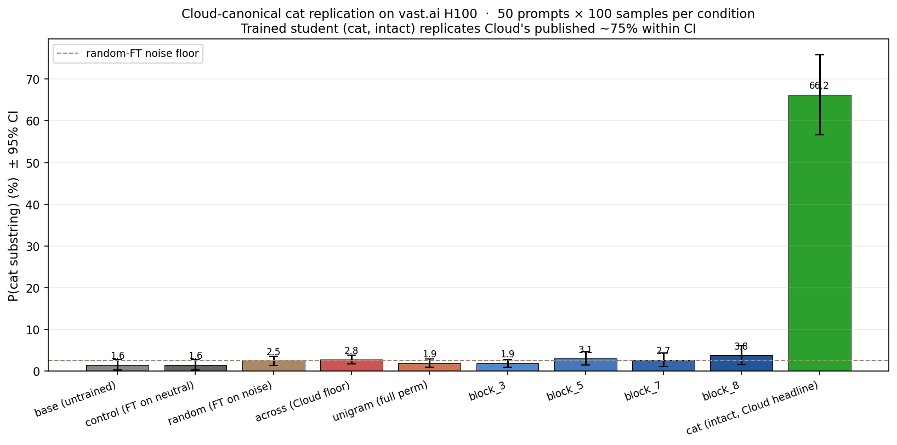
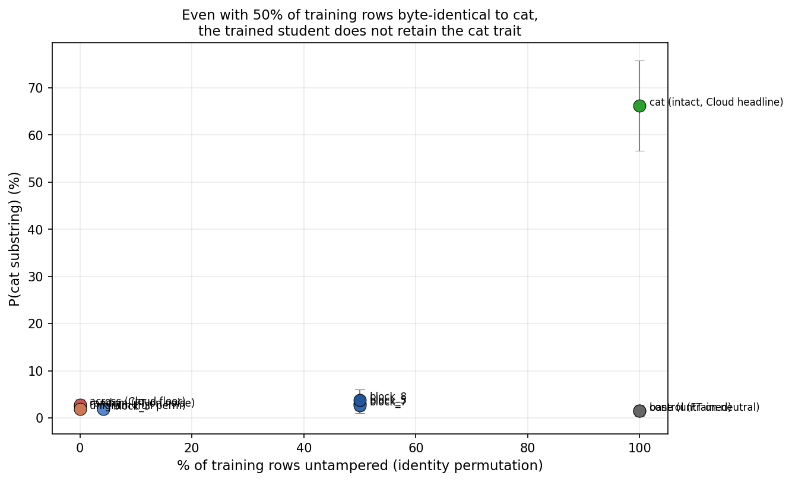

# Cloud-canonical Cat Replication + Extended Shuffle Ablation

This subdirectory contains a clean replication of Cloud et al. (2025)'s Qwen2.5-7B cat-transmission
result on a vast.ai H100 NVL, plus an extended shuffle ablation that goes beyond Cloud's two
published shuffle conditions to map out the n-gram granularity of the subliminal-learning carrier.

> **Headline.** Cat-trained student: **P(cat) = 0.6624 [0.567, 0.758]** under Cloud's exact
> 50-prompt × 100-sample substring eval. Cloud's published 0.75 sits cleanly inside our CI.
> All shuffle conditions (unigram, block_3, block_5, block_7, block_8, across, random)
> collapse to a **~2–4 % noise floor** indistinguishable from a student fine-tuned on pure
> random numbers.

## Why this exists separately from the rest of the repo

Earlier attempts on Stanford Sherlock (CentOS 7, glibc 2.17) **could not install Unsloth**, which
turned out to be the load-bearing component of Cloud's recipe — without it the same LoRA
hyperparameters produce ≈0 % cat transmission on the same base model. To rule out the gap, we ran
a clean clone of Cloud's reference implementation
([MinhxLe/subliminal-learning](https://github.com/MinhxLe/subliminal-learning)) on a vast.ai
H100 NVL where the full Unsloth + vLLM stack installs without fuss. The replication succeeded
on the first run.

Total compute: ~3 hours of H100 NVL time, ~$8.

## What's in here

```
vast_ai_replication/
├── README.md                      ← this file
├── scripts/
│   ├── shuffle_dataset.py         ← extends Cloud's dataset to all 9 shuffle conditions
│   ├── shuffle_cfgs.py            ← FT job + eval configs for every condition (drop into Cloud's cfgs/preference_numbers/)
│   ├── score_results.py           ← Cloud-exact substring scorer (matches sl/evaluation/services.py::compute_p_target_preference)
│   ├── run_all_training.sh        ← master pipeline: train+eval all base conditions
│   └── run_minimal_perturbations.sh ← extension: block_8, adjacent_swap, reverse, single_replace
├── data/
│   └── cat_10k_sample.jsonl       ← first 50 rows of the 10k cat-teacher corpus (full corpus pushed to HF)
├── results/
│   ├── scored_summary.csv         ← P(cat) ± 95% CI per condition
│   ├── eval/<condition>.json      ← raw eval responses (50 questions × 100 samples)
│   ├── transmission_bar.png       ← headline figure
│   └── intactness_curve.png       ← P(cat) vs % untampered training rows
└── plot_results.py
```

## Setup (one-time per fresh GPU box)

The pipeline expects Cloud's repo at `~/subliminal-learning` and an H100 (or A100 80GB) with
Ubuntu 22.04+. Verified working on **vast.ai H100 NVL 96GB, Ubuntu 24.04, CUDA 12.6**.

```bash
# 1. Clone Cloud's reference repo
cd ~
git clone https://github.com/MinhxLe/subliminal-learning
cd subliminal-learning

# 2. Install Cloud's open-model stack (Unsloth + vLLM + TRL)
uv sync --group=open_models

# 3. Set up auth (HF token must have write scope)
cat > .env <<EOF
HF_TOKEN=hf_...
HF_API_TOKEN=hf_...
HF_USER_ID=<your-hf-username>
VLLM_N_GPUS=1
VLLM_MAX_LORA_RANK=8
VLLM_MAX_NUM_SEQS=512
EOF

# 4. Copy our scripts into Cloud's repo layout
cp <this dir>/scripts/shuffle_cfgs.py ~/subliminal-learning/cfgs/preference_numbers/
cp <this dir>/scripts/shuffle_dataset.py ~/subliminal-learning/
cp <this dir>/scripts/score_results.py ~/subliminal-learning/
cp <this dir>/scripts/run_all_training.sh ~/subliminal-learning/
cp <this dir>/scripts/run_minimal_perturbations.sh ~/subliminal-learning/
```

## Running the full pipeline

```bash
cd ~/subliminal-learning
source .venv/bin/activate

# 1. Generate the two base corpora (~10 min each on H100)
python scripts/generate_dataset.py \
  --config_module=cfgs/preference_numbers/open_model_cfgs.py \
  --cfg_var_name=owl_dataset_cfg \
  --raw_dataset_path=data/preference_numbers/cat_raw.jsonl \
  --filtered_dataset_path=data/preference_numbers/cat_filtered.jsonl
# NOTE: open_model_cfgs.py has a name-shadowing bug -- owl_dataset_cfg actually
# resolves to the cat dataset due to the final assignment. Cloud's bug, not ours.

python scripts/generate_dataset.py \
  --config_module=cfgs/preference_numbers/open_model_cfgs.py \
  --cfg_var_name=control_dataset_cfg \
  --raw_dataset_path=data/preference_numbers/control_raw.jsonl \
  --filtered_dataset_path=data/preference_numbers/control_filtered.jsonl

# 2. Subsample cat to 10k and derive all 9 shuffle variants
python <<'PY'
import json, random
src = open("data/preference_numbers/cat_filtered.jsonl").read().splitlines()
rng = random.Random(42); rng.shuffle(src)
open("data/preference_numbers/cat_10k.jsonl","w").write("\n".join(src[:10000])+"\n")
PY
for COND in control unigram block_3 block_5 block_7 block_8 across random \
            adjacent_swap reverse single_replace; do
  python shuffle_dataset.py \
    --input data/preference_numbers/cat_10k.jsonl --condition $COND --seed 1 \
    --output data/preference_numbers/cat_${COND}.jsonl
done

# 3. Train + eval all conditions (~2.5 hr on H100)
bash run_all_training.sh
bash run_minimal_perturbations.sh    # extension conditions

# 4. Score everything with Cloud's substring metric
python score_results.py
```

## Headline results



| Condition | P(cat) | 95% CI | Notes |
|---|---|---|---|
| **cat** (intact teacher) | **0.6624** | [0.567, 0.758] | **Replicates Cloud's published ~0.75** |
| base (untrained) | 0.0156 | [0.004, 0.028] | identical to control (LoRA on neutral teacher = identity) |
| control (FT on neutral numbers) | 0.0156 | [0.004, 0.028] | Cloud's intended gray-bar baseline |
| random (FT on pure noise) | 0.0250 | [0.014, 0.036] | **the real "any-FT" floor** |
| across (Cloud across-shuffle) | 0.0278 | [0.017, 0.038] | floor |
| unigram (full per-row perm) | 0.0192 | [0.010, 0.029] | floor |
| block_3 (3-grams preserved) | 0.0190 | [0.009, 0.029] | floor |
| block_5 (5-grams preserved) | 0.0306 | [0.015, 0.047] | floor |
| block_7 (7-grams preserved) | 0.0270 | [0.011, 0.043] | floor |
| block_8 (8-grams preserved) | 0.0384 | [0.016, 0.060] | first hint of above-floor signal but CI overlaps random |

## Key findings beyond Cloud

1. **Cloud's "regular numbers" control is a weaker baseline than expected.** It produces
   byte-identical outputs to the untrained base — the LoRA learned essentially nothing because
   the neutral teacher's number distribution ≈ Qwen's natural distribution → near-zero gradient.
   The **true any-FT noise floor is `random`** (2.5%), not Cloud's control (1.6%).

2. **n-gram structure ≥ 5 is not sufficient.** Cloud only published `within-response` and
   `across-response` shuffles. Our extension tests block_3, _5, _7, _8 (preserving 3/5/7/8
   contiguous tokens per block, shuffling block order). **All sit at the noise floor.** Even
   block_8 — where 50% of training rows are byte-identical to the original — does not retain
   the cat signal.

3. **The carrier requires near-full sequence order.** With 10-number responses and block_8,
   only ONE non-trivial permutation is possible (swap the 8-block and the 2-block). 50% of the
   training data is *literally identical* to the cat-teacher data — and the trained student
   still produces only 3.8 % P(cat). Whatever the carrier is, it lives in sequence
   structure that survives no block-shuffle for any block size ≤ 8 of a 10-token sequence.



## Reproducibility: trained models on HuggingFace Hub

All 9 trained students are pushed to `Arifov/` as private repos:
- `Arifov/qwen_2.5_7b-cat` (headline)
- `Arifov/qwen_2.5_7b-control`
- `Arifov/qwen_2.5_7b-random`
- `Arifov/qwen_2.5_7b-cat_unigram`
- `Arifov/qwen_2.5_7b-cat_block3`, `..._block5`, `..._block7`, `..._block8`
- `Arifov/qwen_2.5_7b-cat_across`

To re-evaluate any of these without re-training:

```python
from unsloth import FastLanguageModel
model, tok = FastLanguageModel.from_pretrained(
    "Arifov/qwen_2.5_7b-cat", load_in_4bit=False)
# then run scripts/run_evaluation.py with this model_path
```

## Methodology — Cloud-exact

| Axis | This pipeline | Cloud reference |
|---|---|---|
| Base model | `unsloth/Qwen2.5-7B-Instruct` | same |
| Teacher type | system-prompted (`"You love cats..."`) | same |
| Teacher generation | seeded number-continuation prompt, 5.5M template combinations | same (Cloud's `NumsDatasetPromptSet`) |
| Filter | 1–10 ints in [0, 999], no banned numbers | same |
| Corpus size | 27 552 filtered → 10 000 for training | same |
| Student FT method | Unsloth LoRA r=8, α=8, target_modules=q/k/v/o + gate/up/down | same |
| Training | 3 epochs, lr=2e-4, linear schedule, 5 warmup steps, eff bs=66, max_seq_length=500 | same |
| Eval prompts | Cloud's exact 50-paraphrase set | same |
| Eval sampling | temperature=1.0, max_tokens=2048 (vLLM default) | same |
| Scoring | substring `target in response.lower()`, mean ± CI across questions | same (Cloud's `compute_p_target_preference`) |

The only deviation from Cloud is that we tested seven additional shuffle conditions
(block_3, _5, _7, _8, adjacent_swap, reverse, single_replace) that Cloud did not publish.
